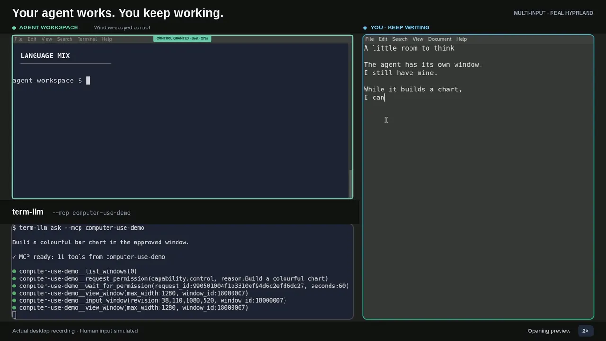

# Hyprland Computer Use

Let an MCP agent view and control **windows you approve**, with a local Quickshell permission console and tray icon. Access starts denied; you choose the windows and duration, and can pause or revoke it.

With seat-aware applications, the agent can work in its approved window **while you keep typing and using the mouse in yours**.

<a href="docs/demo.mp4?raw=true">
  <picture>
    <source media="(prefers-reduced-motion: reduce)" srcset="docs/demo-poster.webp">
    
  </picture>
</a>

**[Download the 30-second video · 1080p MP4](docs/demo.mp4?raw=true)** · [Static preview](docs/demo-poster.webp). Real Hyprland footage showing term-llm, its controlled window, and a second window receiving independent input. Human input is simulated; accelerated sections are labelled. [Recording details and limitations](docs/DEMO.md).

> **Threat model:** MCP clients are untrusted, but the compositor plugin, broker, local permission UI, and other processes running as your desktop user are trusted. **An agent with a shell can approve its own requests.** `ui.sock` trusts same-UID callers and does not authenticate Quickshell: “only the local UI may grant” is a transport/API convention, not process isolation. Sharing a terminal transitively grants shell authority. Do not give an agent a same-user shell if you rely on human-only approval. This is scoped computer-use plumbing, **not an OS sandbox**; read [SECURITY.md](SECURITY.md) before exposing it to an agent.

See the [compatibility table](docs/COMPATIBILITY.md) for the pinned Hyprland build, upcoming-version CI, application limits and restart requirements. Input requires the compositor plugin; there is no global injection fallback.

## Quick start

### 1. Get the executable and dependencies

On Arch, install the runtime and plugin-build dependencies:

```sh
sudo pacman -S --needed curl make gcc pkgconf hyprland nlohmann-json \
  wayland libxkbcommon libei quickshell grim ffmpeg
```

**Arch Linux is currently the only tested distribution.** Other distributions may work if they provide the equivalent development packages, but are not part of the support claim. Source builds require **Go 1.26.6 or newer**; release binaries do not require Go.

Install a release binary—no Go compiler needed. Download and inspect the installer first. It verifies the release's keyless Sigstore signature when `cosign` is installed. The recommended `--require-signature` option refuses installation without cosign; without that option it warns before falling back to checksum-only verification, and always checks the selected archive's SHA-256 digest (see [Releasing](docs/RELEASING.md#installer-behavior)).

```sh
curl -fsSLO https://raw.githubusercontent.com/samsaffron/hyprland-computer-use/main/install.sh
less install.sh
sh install.sh --require-signature
# Or choose an exact release:
sh install.sh --require-signature --version v0.1.1
export PATH="$HOME/.local/bin:$PATH"
hyprland-computer-use version
```

Only the **executable** needs to be copied to another desktop; native sources and the UI are bundled. The target still needs the system dependencies above.

### 2. Start it inside your Hyprland session

Run as your normal desktop user, **not root**. Setup compiles the compositor plugin against your running Hyprland headers and refuses a version mismatch instead of loading an incompatible plugin.

```sh
hyprland-computer-use setup
hyprland-computer-use serve
```

Leave `serve` running. **Click its tray icon** to open the permission console. No tray? Run `hyprland-computer-use console` in another terminal.

### 3. Connect your MCP client

Add this to your client's MCP configuration, using the **absolute path** to your executable:

```json
{
  "mcpServers": {
    "computer-use": {
      "command": "/absolute/path/to/hyprland-computer-use",
      "args": ["mcp"]
    }
  }
}
```

The client must run as the same desktop user with the same `XDG_RUNTIME_DIR`. The `mcp` command is a bridge; it does not start the broker.

### 4. Approve a window

Ask the agent to list windows and request access. Approve in the local console, or click **Share** to pick a window yourself. If the console says **PAUSED**, click **Resume**. Use **Pause** or revoke the grant to stop access; closing the last console also pauses and clears grants.

## Other distributions / source build

Arch Linux is the tested target. On other distributions, install equivalent packages before running `setup`; package names and availability vary:

| Purpose | Debian/Ubuntu family | Fedora family |
|---|---|---|
| Compiler/build tools | `build-essential`, `pkg-config` | `gcc-c++`, `make`, `pkgconf-pkg-config` |
| Hyprland private headers | a version-matched `hyprland-dev` package or source tree | a version-matched `hyprland-devel` package or source tree |
| Native libraries | `libwayland-dev`, `libxkbcommon-dev`, `libei-dev`, `nlohmann-json3-dev` | `wayland-devel`, `libxkbcommon-devel`, `libei-devel`, `json-devel`/`nlohmann-json-devel` |
| UI/capture/recording | Quickshell, `grim`, `ffmpeg` | Quickshell, `grim`, `ffmpeg` |

Some stable distributions do not package a recent Quickshell, libei, or matching Hyprland development headers. Do not mix headers from a different Hyprland build. For a source build, install **Go 1.26.6+**, clone this repository, run `make build/hyprland-computer-use`, and then run the built executable's `setup --build-only` before making compositor changes. See [Development](docs/DEVELOPMENT.md) and [Setup](docs/SETUP.md).

## Update or stop

- **Update/check:** rerun the installer (or replace a source-built executable), then run `hyprland-computer-use setup`. Setup is idempotent: if the guard and running broker already match, it reports that everything is OK without restarting either one or clearing grants. It updates only stale components. If an active independent-seat guard differs, setup explicitly requires a full Hyprland session restart; a config reload is not enough. Follow the printed `RESULT` and `NEXT` sections.
- **Stop:** run `hyprland-computer-use stop`, or press Ctrl+C in the broker terminal.
- **Compositor-free build:** `hyprland-computer-use setup --build-only` does not touch the compositor or broker; it still requires the matching native development packages.

No autostart service or compositor-config edit is installed. Service/config-managed installations require their own update procedure.

## Automatic input backend

Setup prefers the independent seat and falls back to the compositor-guarded focus-borrowing build when the seat build or required hook is unavailable. During execution, clients with both agent-seat devices use **Seat**; other clients use **Fallback**, under the same window grant. The green grant outline shows the selected path. Fallback temporarily borrows native protocol focus and requires idle human input; it is not independent input.

**An active independent-seat plugin requires a full Hyprland restart only when the requested build differs.** Rerunning setup with the already-current plugin is a non-disruptive check; do not hot-unload it yourself. When replacement is needed, setup prints `RESULT: HYPRLAND RESTART REQUIRED` and exact next steps.

## Supported and tested scope

| Area | Current status |
|---|---|
| Distribution | Arch Linux is the only tested distribution. |
| Compositor | Hyprland 0.56.2 at commit `efb50993780079460b0cbed1363e2166a2de1d9f`; every install must compile against headers matching its exact running commit. Other releases are unsupported until validated. |
| Windows | Native Wayland toplevels; XWayland is unsupported. Popup/subsurface routing has unit coverage but limited live toolkit validation. |
| Input | Independent seat when supported, otherwise guarded focus borrowing. Unicode/bulk text, physical interleaving, and application behavior still have documented live-validation gaps. |
| Capture | Actual foreign-toplevel capture. Opaque-window behavior is tested; transparent/blurred/protected content and lock-transition confidentiality are not fully validated. |
| Network | Private Unix sockets are the supported default. HTTP/OAuth is opt-in and experimental for non-loopback or hostile-network deployment pending independent review. |

See [Testing status](docs/TESTING.md) for the evidence behind these claims and [Security](SECURITY.md) for limitations.

## Go deeper

| Guide | Contents |
|---|---|
| [Setup and troubleshooting](docs/SETUP.md) | Detailed installation, startup errors, updates, storage |
| [Permissions and sharing](docs/USAGE.md) | Grants, YOLO, window picker, shortcuts, Waybar |
| [Architecture and tool reference](docs/REFERENCE.md) | MCP tools, input examples, focus behavior, limitations |
| [Remote access / OAuth](docs/AUTH.md) | HTTP, TLS, authentication and connection approval |
| [Development](docs/DEVELOPMENT.md) | Source layout, builds, tests, manual plugin loading |
| [Releasing](docs/RELEASING.md) | GoReleaser archives, checksums, publishing workflow |
| [Popups, subsurfaces and dialogs](docs/SURFACES.md) | Surface selectors, separate dialog approval and current limitations |
| [Unicode and bulk text](docs/TEXT_INPUT.md) | Text contract, upgrade requirements and two-window manual test |
| [Testing status](docs/TESTING.md) | Exact lab versions, verified and unverified behavior |
| [Security](SECURITY.md) | Trust boundaries and guarantees |

[MIT license](LICENSE) · [Changelog](CHANGELOG.md) · [Contributing](CONTRIBUTING.md) · [Third-party notices](THIRD_PARTY.md)
